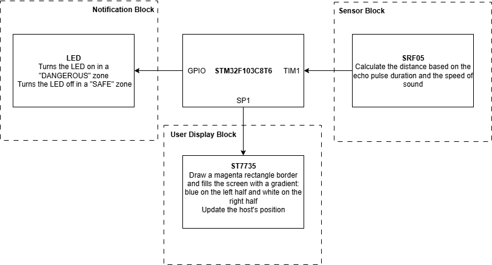
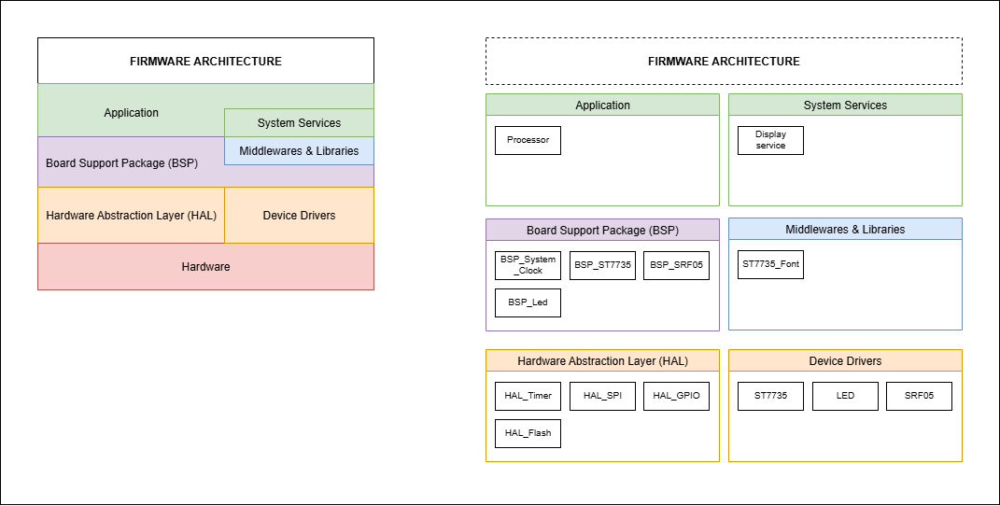
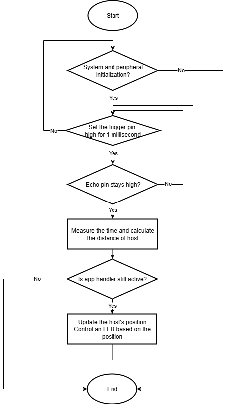

# Smart Proximity Alert System
## Table of Contents

- [Smart Proximity Alert System](#smart-proximity-alert-system)
  - [Table of Contents](#table-of-contents)
  - [Overview](#overview)
  - [Key Features](#key-features)
  - [Technologies](#technologies)
  - [Functional Requirements](#functional-requirements)
  - [|FR6|LED Danger Indication|Turn on an LED when the host is in the dangerous zone and turn off the LED when the host is in the safe zone.|LED|](#fr6led-danger-indicationturn-on-an-led-when-the-host-is-in-the-dangerous-zone-and-turn-off-the-led-when-the-host-is-in-the-safe-zoneled)
  - [Hardware Block Diagram](#hardware-block-diagram)
  - [Layered Architecture](#layered-architecture)
  - [Flowchart](#flowchart)
  - [Repository Layout](#repository-layout)
  - [Getting Started](#getting-started)
  - [Key Implementation Details](#key-implementation-details)
  - [Contributing](#contributing)
  - [Demo](#demo)

## Overview

- The primary objective of Smart Proximity Alert System (SPAS) is to provide immediate and actionable alerts by continuously monitoring the distance of objects in its field of view. 
- It dynamically categorizes these distances into predefined "SAFE" and "DANGEROUS" zones, triggering both visual (on-screen messages, graphical host position) and discrete (LED indicator) notifications when an object enters a critical "DANGEROUS" threshold.
- **Bare-Metal Implementation**: All peripheral configuration is performed at the register level without using HAL libraries, providing fine-grained control over SPI, Timer, RCC, GPIO, AFIO, and EXTI modules.
---

## Key Features
 - **Real-time Proximity Sensing**: Continuously measures distance using an SRF05 ultrasonic sensor, providing instant feedback on object proximity.
- **Dynamic Zone-Based Alerting**: Classifies object distance into distinct "SAFE" and "DANGEROUS" zones and triggers immediate alerts based on zone transitions.
- **Multi-Modal User Feedback**:
    - **Visual Display**: Utilizes an ST7735 TFT screen to graphically represent the "host" object's position and display clear textual messages ("DANGEROUS" in red, "SAFE" in green).
    - **LED Indication**: Provides a clear, dedicated LED alert that illuminates when the object enters the "DANGEROUS" zone and turns off when in "SAFE" zone.
- **Efficient Display Management**: Implements logic for drawing and clearing dynamic objects on the display to ensure smooth visual updates and prevent ghosting.
---

## Technologies
- **IDE**: Keil MDK-ARM (Keil C51 uVision)
- **MCU**: STM32F103C8T6 (ARM Cortex-M3)
- **Approach**: Bare-Metal Register-Level Programming (no HAL library)
- **Configured Modules**: RCC (Reset & Clock Control), GPIO (General Purpose I/O), AFIO (Alternate Function I/O), SPI (Serial Peripheral Interface), Timer (PWM & Timing), EXTI (External Interrupts)
- **Peripherals**: SRF05 Ultrasonic Sensor, ST7735 TFT Display, LED
---

## Functional Requirements
|ID|Feature Name|Description|Source/ Hardware Module|
|-|-|-|-|
|FR1|System Initialization|Initialize the system through bare-metal register configuration, including RCC clock setup (72 MHz PLL), GPIO/SPI configuration for ST7735 display, Timer setup for SRF05 sensor, and LED GPIO.|RCC, GPIO, AFIO, SPI, Timer
|FR2|Distance Measurement & Scaling|Continuously measure distance from the SRF05 sensor and scale the distance value to a host position (0-127) for display.|SRF05|
|FR3|Dynamic Host Position Display|Display the host's position as a 4x4 pixel object on the ST7735 screen, with varying colors depending on its current zone (dangerous/safe).|ST7735|
|FR4|Danger Zone Detection|Detect when the host's position falls within a predefined "dangerous zone" (x < 64).|ST7735|
|FR5|Visual Danger Alert|Display a "DANGEROUS" message in red on the screen when the host is in the dangerous zone, and a "SAFE" message in green when in the safe zone. Clear previous messages upon state change.|ST7735|
|FR6|LED Danger Indication|Turn on an LED when the host is in the dangerous zone and turn off the LED when the host is in the safe zone.|LED|
---
## Hardware Block Diagram


---

## Layered Architecture


---

## Flowchart


---

## Repository Layout
```
Code/
├── App/            
│   ├── Inc/         
│   └── Src/         
├── BSP/             
│   ├── Inc/
│   └── Src/
├── Core/
│   ├── Inc/
│   └── Src/
├── DeviceDrivers/
│   ├── Inc/
│   └── Src/
├── HardwareAbstraction/
│   ├── Inc/
│   └── Src/
├── Middlewares&Libraries/
│   ├── Inc/
│   └── Src/
├── SystemService/
│   ├── Inc/
│   └── Src/

Docs/            
├── BlockDiagram/
├── Flowchart/
└── LayeredArchitecture/

README.md        
```
---

## Getting Started
1. Clone the Repository
2. Open in Keil MDK-ARM: Ensure you have Keil MDK-ARM installed with STM32F1 device support.
3. Hardware Connection: Connect your STM32F103C8T6 development board, SRF05 sensor, ST7735 TFT display, and LED according to the [Hardware Block Diagram](#hardware-block-diagram).
4. Register Configuration Reference: Review the bare-metal header files in `hal_rcc.h`, `hal_gpio.h`, and device driver files in `Code/DeviceDrivers/` to understand the register-level configuration approach.
5. Build and Flash: Compile the firmware in Keil MDK-ARM and flash it to your MCU using an ST-Link debugger/programmer.
---

## Key Implementation Details
- **Bare-Metal Architecture**: All peripheral configuration is performed through direct register manipulation without abstraction layers.
- **Clock Configuration**: RCC module configured for 72 MHz operation using PLL.
- **Peripheral Integration**: SPI for display communication, Timers for sensor timing and PWM, GPIO/AFIO for pin control.
- **Modular Design**: Hardware abstraction implemented through custom register definition headers (`hal_rcc.h`, `hal_gpio.h`) that define bit-field structures for improved readability and maintainability.

## Contributing
I welcome contributions to enhance features, improve stability, or update documentation.
1. Fork the repository and create a new branch for your feature or bug fix.
2. Implement your changes and commit them with clear messages.
3. Open a Pull Request (PR), describing the modifications you've made.
4. Address any review comments to get your changes merged.
---

## Demo
[Smart Proximity Alert System](https://youtu.be/pPYZduCxOzM)

---

Thank you for visiting this repository!